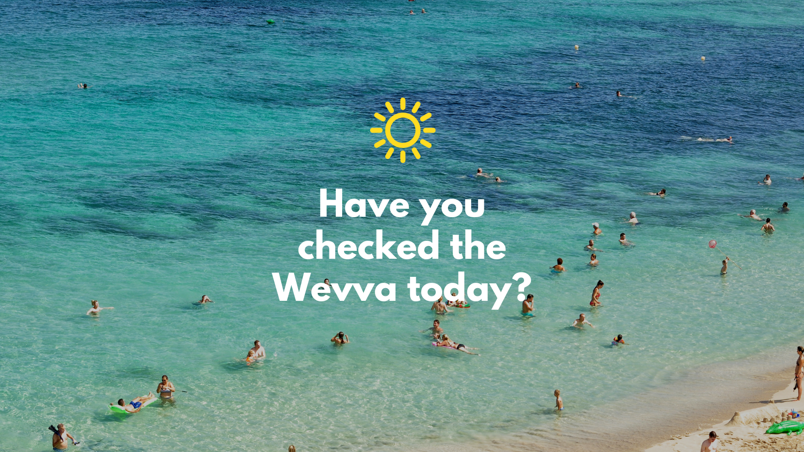
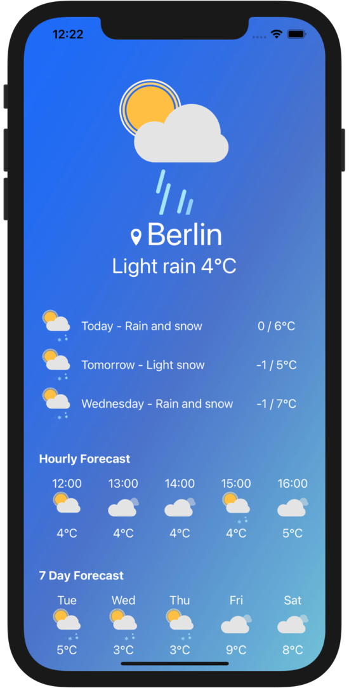
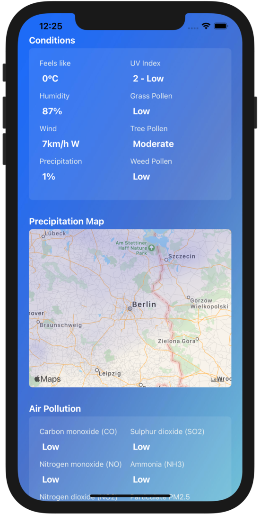

# **Wevva ☀️**

### About 📱

Wevva is a cross-platform smartphone app built with React Native. It can be used for checking weather, pollen and air quality forecasts both in your local area and anywhere else in the world. 

### Installation 💻

To run the app locally:

1. Install Expo CLI on your machine: 

   `npm install -g expo-cli`

2. Fork and clone this repo

3. Run `npm install` from the main folder to install dependencies

4. Obtain an API key from <a href="https://openweathermap.org/">OpenWeatherMap.org</a> and place it into a .env file in the main folder

   `EXPO_API_KEY_OWM=YOUR_API_KEY_HERE`

5. Run `npm start` from the main folder to start Expo

